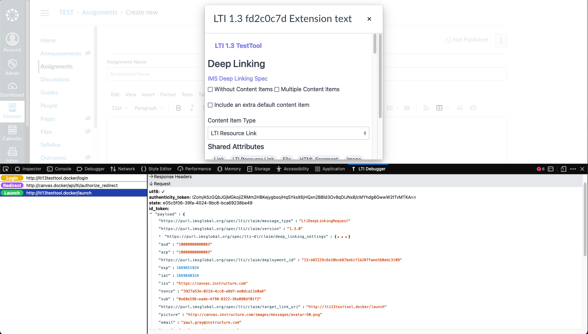

## View & debug LTI requests from within the developer tools

This plugin adds a "Lti Debugger" pane in the developer tools which listens for LTI requests, and displays them as they resolve. It also parses JWT parameters, and displays them as navigable JSON.

[](https://addons.mozilla.org/en-US/firefox/addon/lti-debugger/)



### Local Development

```
yarn install
yarn build
yarn start
```
